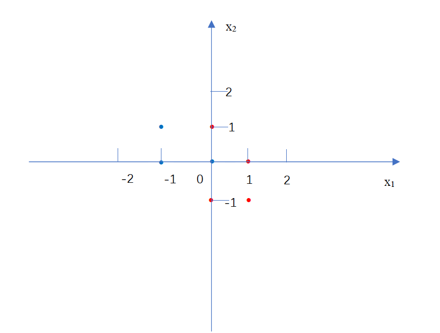
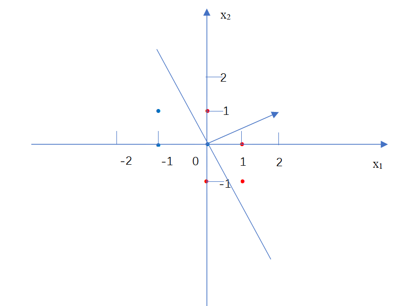
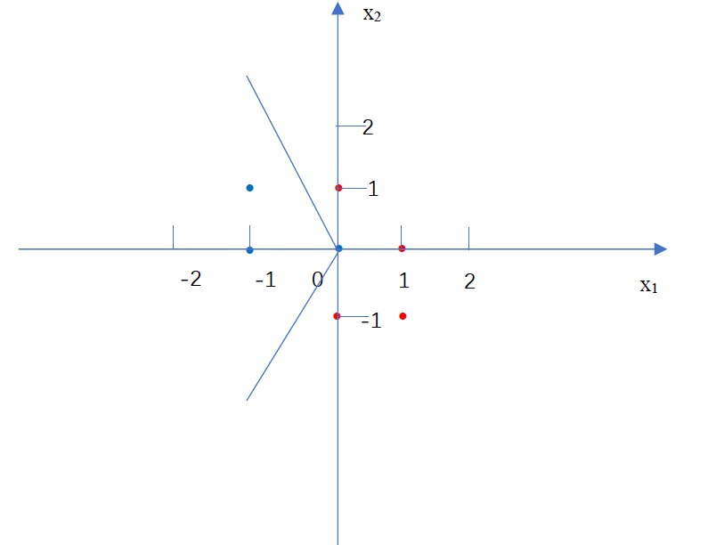

# Homework 5

## Part 1 

1. $P(Y)$	

    |Y|P(Y)|
    |-|-|
    |-y|3/7|
    |+y|4/7|

    $P(X_1|Y)$ 

    |$X_1$|Y|$P(X_1|Y)$|
    |-|-|-|
    |-1|-y|2/3|
    |0|-y|1/3|
    |1|-y|0|
    |-1|+y|0|
    |0|+y|1/2|
    |1|+y|1/2|

    $P(X_2|Y)$

    | $X_2$ | Y    | $P(X_2|Y)$ |
    | ----- | ---- | ---------- |
    | -1    | -y   | 0          |
    | 0     | -y   | 2/3        |
    | 1     | -y   | 1/3        |
    | -1    | +y   | 1/2        |
    | 0     | +y   | 1/4        |
    | 1     | +y   | 1/4        |

2. $P(+y|X_1=+1, X_2=+1)= P(+y)*p(X_1=+1|+y)*P(X_2=+1|+y)=1/14$

   $P(-y|X_1=+1,X_2=+1) = P(-y)*P(X_1=+1|-y)*P(X_2=+1|-y)=0$

   Since $P(+y|X_1=+1, X_2=+1)>P(-y|X_1=+1, X_2=+1)$ , We predict +y.

3. We have the equation $\frac{c(x)+k}{N+k|X|}$

   $P(X_1|Y)$

   | $X_1$ | Y    | $P(X_1|Y)$ |
   | ----- | ---- | ---------- |
   | -1    | -y   | 1/2        |
   | 0     | -y   | 1/3        |
   | 1     | -y   | 1/6        |
   | -1    | +y   | 1/7        |
   | 0     | +y   | 3/7        |
   | 1     | +y   | 3/7        |

   $P(X_2|Y)$

   | $X_2$ | Y    | P    |
   | ----- | ---- | ---- |
   | -1    | -y   | 1/6  |
   | 0     | -y   | 3/6  |
   | 1     | -y   | 2/6  |
   | -1    | +y   | 3/7  |
   | 0     | +y   | 2/7  |
   | 1     | +y   | 2/7  |

4. $X_1 = 0 \ and\  X_2 = -1$ or $X_1=1\ and \ X_2= -1$ , We can get the maximum of $P(X_1, X_2, Y+y)$

# Part 2 

1. 

   As we can see ,the data is not linearly separable.

2. 

   It will predict it as +y. 

3. - For $X_3=1$ , doesn't allow because it only add a bias term to the linear classifier but the data is not linearly separable.

   - For $X_3 = |X_1|$ , doesn't allow because for point (0, 1, 0), (0,-1, 0), $w$ should be (a, 0, b)  (a and b are some real number) to classify them to the same category, but in this case the classifier will also judge (0, 0, 0) to the same category, which is wrong.

   - For $X_3=|X_2|$, allow. Let $w = (2, 0, 1 )$, the decision boundary is $x_1 = -\frac{1}{2}|x_2|$, which shows as below:

   

   ​	As we can see, this boundary perfectly separate the data. 

   - For $X_3= X_1^2,$ doesn't allow because for point (0, 1, 0), (0,-1,0), $w$ should be (a, 0, b)  (a and b are some real number) to classify them to the same category, but in this case the classifier will also judge (0, 0, 0) to the same category, which is wrong.

   - For $X_3 = X_2^2$ , allow because the decision boundary could be a parabola going leftwards. Just let $w = (1, 0, 1)$, the decision boundary is $x_1 = - x_2^2$, which is a  parabola going leftwards and with original point on it, and it can perfectly separate the data.

   - For $X_3 = X_1^2 + X_2^2$, allow because its decision boundary could be a circle. We let $w = (2, 0 ,1)$, the decision boundary of the classifier is $2x_1 + x_1^2+x_2^2 = 0$, which is also $(x_1+1)^2+x_2^2 = 1$. This circle can perfectly separate the data.

4. | $\phi(x)$  | $Y(predicated)$ | $w$       |
   | ---------- | --------------- | --------- |
   | (-1, 1, 0) | -y              | (0, 0, 0) |
   | (0, 0, 0)  | -y              | (0, 0, 0) |
   | (-1, 0, 1) | -y              | (0, 0, 0) |
   | (0, 1, 1)  | -y              | (0, 1, 1) |
   | (1, -1, 0) | -y              | (1, 0, 1) |
   | (0, -1, 1) | +y              | (1, 0, 1) |
   | (1, 0, 1)  | +y              | (1, 0, 1) |

5. $(-1,+1,0): -1 + 0 + 0 = -1 => -y \ ,correct $

   $(0,0,0): 0 + 0 + 0 = 0 => -y \ ,correct $

   $(-1,0,1): -1 + 0 + 1 = 0 => -y \ ,correct $

   $(0,1,1): 0 + 0 + 1 = 1 => +y \ ,correct $

   $(1,-1,0): 1 + 0 + 0 = 1 => +y \ ,correct $

   $(0,-1,1): 0 + 0 + 1 = 1 => +y \ ,correct $

   $(1,0,1): 1 + 0 + 1 = 2 => +y \ ,correct $

   So it is able to linearly separate all of them.

## Part 3

1. (0, 0) (1, 0) and (0,1)

   The Euclidean distance is $\sqrt{0.5^2+0.5^2} = 0.71$

   Since (0, 0) is -y, (1, 0) and (0, 1) are +y, we predict oversell.

2. $score=-1*(0+1)+(-2)*1+2*1.52+1*1=2.5>0 => +y $

3. The means:

   $m_1 = (-2/3, 1/3)$

   $m_2=(0,1)$

   $m_3 = (2/3, 2/3)$

   The cluster is:

   m1: (-1, 1) (0, 0) (-1, 0)

   m2: (0, 1)

   m3: (1, -1) (0, -1) (1, 0)

   We predict m1 to -y and m2, m3 to +y.

   For every points in the data, we calculate the Euclidean distances between them and the means, then we can find that :

   | data    | nearest mean |
   | ------- | ------------ |
   | (-1, 1) | m1           |
   | (0, 0)  | m1           |
   | (-1, 0) | m1           |
   | (0, 1)  | m2           |
   | (1, -1) | m3           |
   | (0, -1) | m3           |
   | (1, 0)  | m3           |

   So it is stable.

